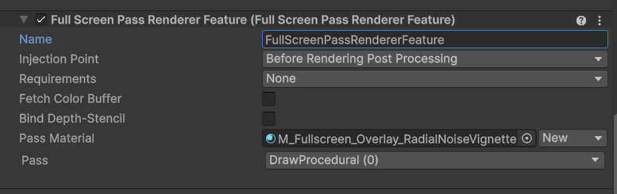
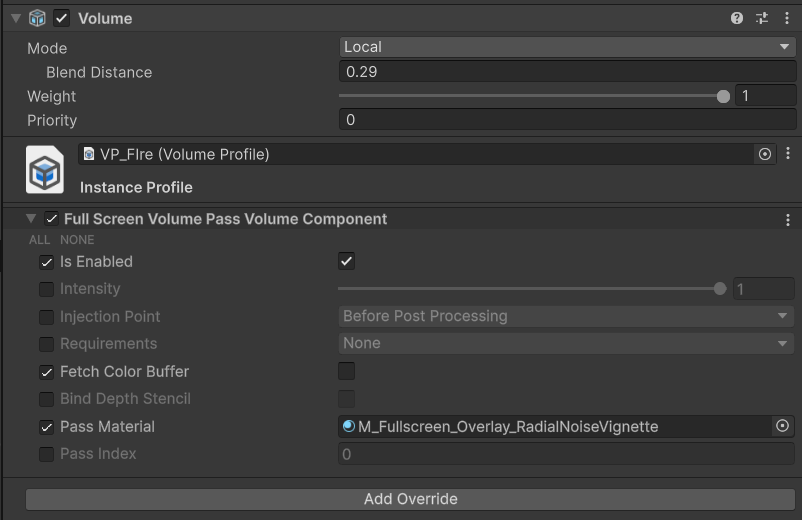

# FullScreenVolumePass

Volumes support for your own custom full screen post-processing effects in **Unity 6 URP 17+**.


Same as built-in fullscreen pass renderer feature but with volumes.




Use this package when you want to drive fullscreen materials from the Volume system (including blendable local/global volumes), without writing a custom renderer feature for every single effect.

## Features

Like built-in renderer feature, this package provides a single, generic renderer feature that can render any fullscreen material at the specified injection point, with the following volume-driven configuration:
 
- Supports **Before Post Processing** and **After Post Processing** injection points.
- Supports optional source color fetch (copy) for effects that need `_BlitTexture`.
- Supports URP input requirements (`Color`, `Depth`, `Normal`, `Motion`).
- Supports optional depth-stencil binding for stencil/depth-aware fullscreen materials.
- Supports priority-based ordering through Volume priority.

## Requirements

- Unity `6000.0.0f1` or newer.
- Universal Render Pipeline `17.0.0` or newer.

This rendering feature uses RenderGraph API, so it requires URP 17+ and won't work in older versions.

## Installation

### Option 1 (Package Manager via Git URL)

1. Open `Window > Package Manager`.
2. Click `+`.
3. Select `Add package from git URL...`.
4. Use:

```text
https://github.com/dgul3d/UnityURPFullScreenVolumePass.git?path=/Packages/com.gulievstudio.fullscreenvolumepass
```

### Option 2 (Local package)

1. Download this repository.
2. Copy `Packages/com.gulievstudio.fullscreenvolumepass` into your project (for example under a local packages folder).
3. Add it as a local package through Package Manager.

## Quick Start

1. In your URP Renderer asset, add **FullScreenVolumePassRendererFeature**.
2. Create a fullscreen-compatible material (for example with Fullscreen Shader Graph target).
3. Add a **Global Volume** (or local Volume) to your scene.
4. Add override: `Post-processing/Custom fullscreen volume pass`.
5. Configure:
	 - `Is Enabled`
	 - `Requirements`
	 - `Fetch Color Buffer`
	 - `Pass Material`

## Volume Component Fields

- **Is Enabled**: turns the effect on/off.
- **Intensity**: value passed to material property `_Intensity`.
- **Injection Point**:
	- `BeforePostProcessing`
	- `AfterPostProcessing`
- **Requirements**: requests URP textures the shader may need.
- **Fetch Color Buffer**: copies active color to `_BlitTexture` source path.
- **Bind Depth Stencil**: binds active depth-stencil when drawing fullscreen pass.
- **Pass Material**: material used for rendering.
- **Pass Index**: pass index in the selected material.

## Notes

- If multiple different volume sources share the same material instance, the package logs an error about material state coupling.
- As with any fullscreen effect, use backbuffer fetch only when necessary for best performance. 

## Samples

- Scene sample exists under `Samples/FullScreenVolumePass.unity`. 
- You can find fullscreen shader graph examples in `Samples/Shaders`. SG_Fullscreen_Distortion uses backbuffer fetch, while SG_FullscreenNoiseVignette and SG_FullscreenRadialNoiseVignette are just overlay effects with alpha blending.
- 
## Additional Links

- Code: https://github.com/dgul3d/UnityURPFullScreenVolumePass
- Issues: https://github.com/dgul3d/UnityURPFullScreenVolumePass/issues
- Author: https://github.com/dgul3d
